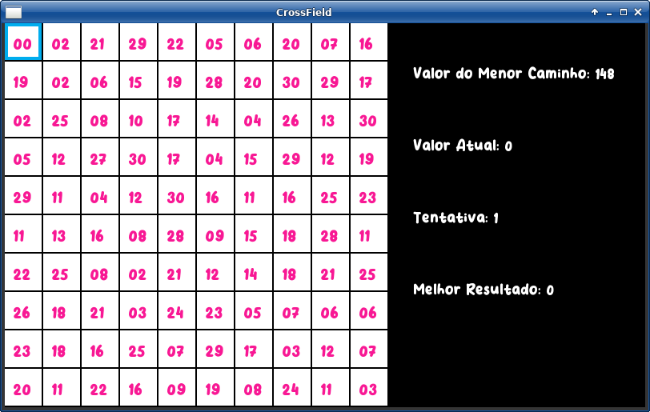
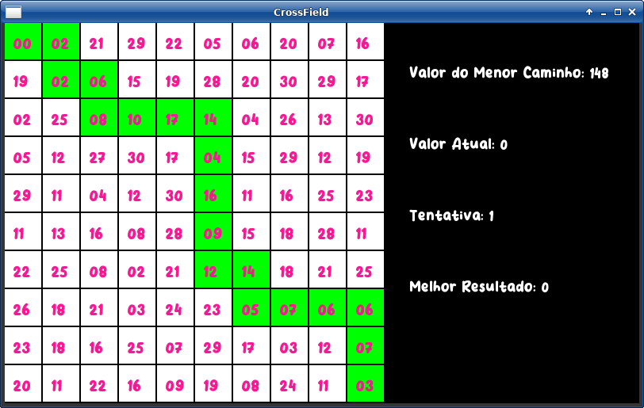
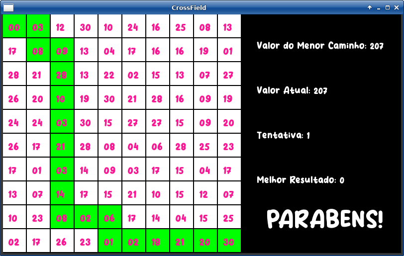

# CrossField

**Número da Lista**: 32 
**Conteúdo da Disciplina**: Grafos 02 

## Alunos
|Matrícula | Aluno |
| -- | -- |
| 18/0149687 |  Daniel Porto de Souza |

## Sobre 
 CrossField é um mini game matemático. O objetivo é, dada uma matriz 10x10, percorrer o caminho de celulas cujo o somatório dos valores em seu conteúdo seja o mínimo possível. O game se inicia na Célula 1X1 e termina ao chegar na 10x10.

## Screenshots

## Instalação 
**Linguagem**: C++ 

### Requisitos
 - make;
 - g++;
 - git;

## Uso 
Para a utilização, basta clonar o repositório com:
> $ git clone https://github.com/projeto-de-algoritmos/Grafos2_CrossField.git

Feito a clone, dentro do diretório do repositório, basta compilar o projeto com o comando:

> $ make

Para iniciar o Game:

> $ make run
## Controles
- Setas direcionais para movimentar na matrix;
- Tecla g para desistir e ver o caminho vencedor;
- Tecla enter para reiniciar no meio da partida

### Observação
Para trocar a matriz é preciso reiniciar o game, a cada inicialização é gerada uma matriz diferente.
